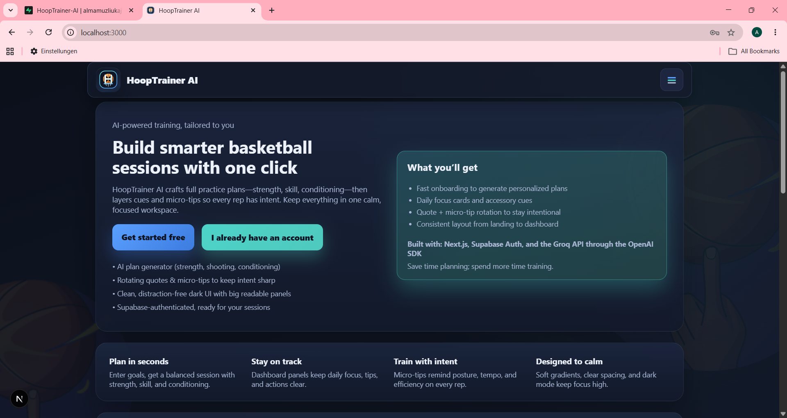
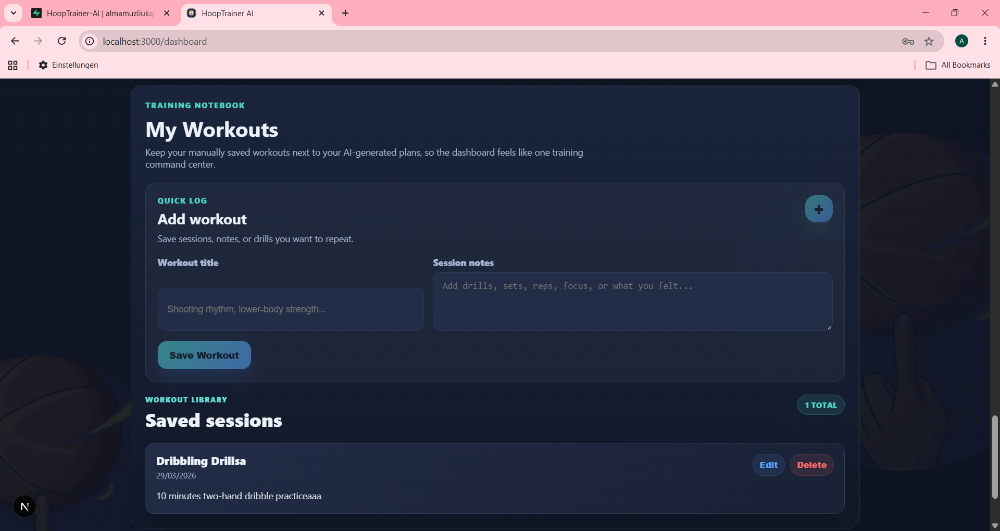
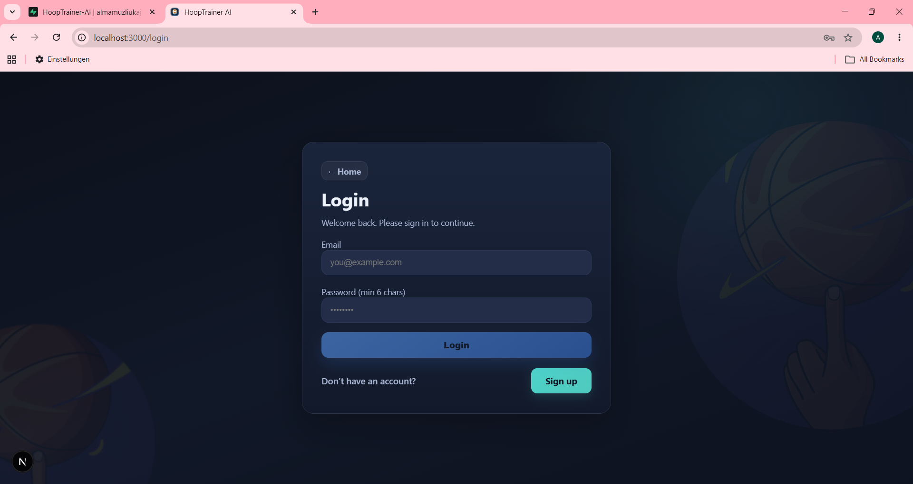

<div align="center">

# HoopTrainer AI

### AI-powered basketball training planner, workout tracker, and player development dashboard.

[](https://nextjs.org/)
[](https://react.dev/)
[](https://www.typescriptlang.org/)
[](https://supabase.com/)
[](https://groq.com/)

**Live Demo:** [https://hoop-trainer-ai.vercel.app](https://hoop-trainer-ai.vercel.app)



</div>

---

## Overview

HoopTrainer AI is a full-stack basketball training app built to help players train with structure and consistency.
It combines AI-assisted plan generation, personal workout tracking, and a player profile system so workouts can be personalized over time.

## Why this project

Most training apps are generic. HoopTrainer AI is focused on basketball-specific development:

- Skill and conditioning plans generated with AI
- Saved training conversations and reusable plans
- Player profile context (position, goals, level, equipment)
- Daily challenge momentum with streaks and progression systems

## Core Features

- **Authentication & Protected App**
  - Email/password authentication with Supabase
  - Protected dashboard and account pages

- **AI Training Planner**
  - Multi-turn planner chat
  - Conversation history with rename/delete support
  - Save AI responses as reusable training plans

- **Dashboard & Progression**
  - Daily challenge tracking
  - Streaks, XP, ranks, quests, and badges
  - Weekly progress and activity insights

- **Workout Library**
  - Add, edit, and delete personal workouts
  - Responsive workout cards and empty states

- **Player Profile Personalization**
  - Account onboarding/profile completion
  - Profile context used for smarter AI responses

## Product Screenshots

HoopTrainer AI includes a polished landing page, protected auth flow, AI planner, player dashboard, saved plan modal, workout CRUD, and account/profile management.

<table>
  <tr>
    <td width="50%">
      
      <br />
      <strong>Landing page</strong>
      <br />
      Product overview with basketball-focused branding and demo-ready navigation.
    </td>
    <td width="50%">
      
      <br />
      <strong>AI Generator</strong>
      <br />
      Saved chat workspace for generating personalized basketball training plans.
    </td>
  </tr>
  <tr>
    <td width="50%">
      
      <br />
      <strong>Dashboard overview</strong>
      <br />
      Training command center with progress, saved plans, challenges, and player context.
    </td>
    <td width="50%">
      
      <br />
      <strong>Progress tracking</strong>
      <br />
      XP, rank, weekly activity, streaks, quests, and player development signals.
    </td>
  </tr>
  <tr>
    <td width="50%">
      
      <br />
      <strong>Saved plan modal</strong>
      <br />
      Reopen AI-generated training plans from the dashboard for future sessions.
    </td>
    <td width="50%">
      
      <br />
      <strong>Workout library</strong>
      <br />
      Add, edit, and delete personal workouts from the authenticated dashboard.
    </td>
  </tr>
  <tr>
    <td width="50%">
      
      <br />
      <strong>Account settings</strong>
      <br />
      Player profile setup for position, goals, equipment, level, and AI personalization.
    </td>
    <td width="50%">
      
      <br />
      <strong>Authentication</strong>
      <br />
      Clean login and signup flow backed by Supabase Auth.
    </td>
  </tr>
</table>

Additional screenshots are available in [`public/Screenshots`](public/Screenshots), including signup, dashboard detail views, terms, and privacy pages.

## Tech Stack

- **Framework:** Next.js 16 (App Router)
- **Frontend:** React 19 + TypeScript
- **Auth & Database:** Supabase
- **AI Integration:** OpenAI SDK with Groq (OpenAI-compatible endpoint)
- **Rendering:** react-markdown for safe AI response rendering
- **Styling:** Global/custom CSS with responsive app layouts

## Architecture Summary

- `src/app/page.tsx` - Public landing page
- `src/app/login/page.tsx` / `src/app/signup/page.tsx` - Authentication flows
- `src/app/dashboard/page.tsx` - Main user dashboard
- `src/app/plan/page.tsx` - AI planner chat experience
- `src/app/account/page.tsx` - Profile and player settings
- `src/app/api/generate/route.ts` - AI generation API route
- `src/components/*` - Reusable UI components
- `src/lib/*` - Shared utility logic
- `src/context/AuthContext.tsx` - Auth session context

## Project Structure

```text
src/
  app/
    account/
    api/generate/
    dashboard/
    login/
    plan/
    privacy/
    signup/
    terms/
    globals.css
    layout.tsx
    page.tsx
  components/
  context/
  lib/
```

## Database Notes

Expected Supabase tables:

- `conversations`
- `messages`
- `workouts`
- `training_plans`

Player profile data, daily challenge state, and streak freeze usage are stored in Supabase Auth user metadata.

Example `training_plans` table:

```sql
create table if not exists public.training_plans (
  id uuid primary key default gen_random_uuid(),
  user_id uuid not null references auth.users(id) on delete cascade,
  source_conversation_id uuid references public.conversations(id) on delete set null,
  title text not null,
  content text not null,
  status text not null default 'saved',
  created_at timestamptz not null default now()
);
```

## Environment Variables

Create `.env.local` in the project root:

```env
GROQ_API_KEY=your_groq_api_key
GROQ_API_BASE=https://api.groq.com/openai/v1
NEXT_PUBLIC_SUPABASE_URL=your_supabase_url
NEXT_PUBLIC_SUPABASE_ANON_KEY=your_supabase_anon_key
```

Required variables:

- `GROQ_API_KEY` - API key for AI generation
- `GROQ_API_BASE` - Groq OpenAI-compatible base URL
- `NEXT_PUBLIC_SUPABASE_URL` - Supabase project URL
- `NEXT_PUBLIC_SUPABASE_ANON_KEY` - Supabase anon key for client access

## Getting Started

1. **Clone the repository**
   ```bash
   git clone https://github.com/almamuzliukaj/HoopTrainer-AI.git
   cd HoopTrainer-AI
   ```

2. **Install dependencies**
   ```bash
   npm install
   ```

3. **Add environment variables**
   - Create `.env.local`
   - Add the variables listed above

4. **Run locally**
   ```bash
   npm run dev
   ```

5. Open [http://localhost:3000](http://localhost:3000)

## Available Scripts

- `npm run dev` - Start development server
- `npm run build` - Build production app
- `npm start` - Run production server
- `npm run lint` - Run ESLint

## Roadmap

- Calendar scheduling for training plans
- Dedicated saved plans library page (search/filter/detail)
- Expanded reusable UI primitives
- Automated testing improvements
- Editable challenge history

## Project Status

HoopTrainer AI is currently in a **strong MVP stage** and is actively evolving toward a more complete player-development platform.

## Demo Prep

- Presentation plan: `docs/demo-plan.md`
- Live URL: `https://hoop-trainer-ai.vercel.app`
- Backup: run locally with `npm run dev`

