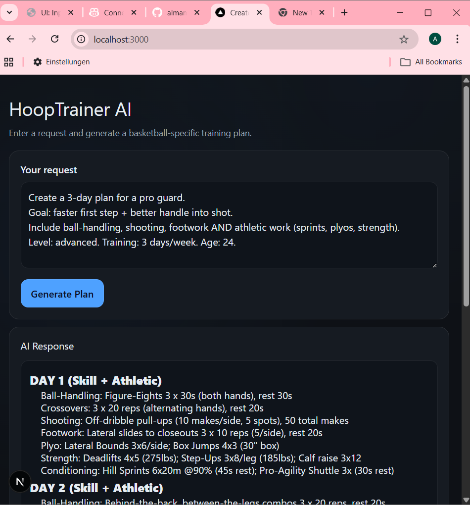
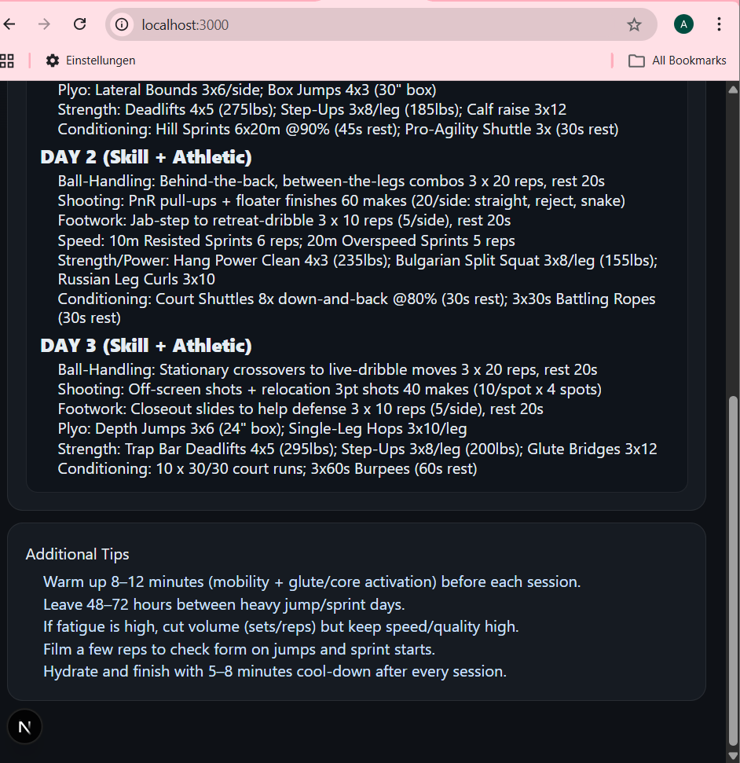

<div align="center">

# 🏀 HoopTrainer AI

**AI-powered basketball training plan generator** that combines on-court skill drills with full athletic development — personalized for your position, goals, and experience level.

[](https://nextjs.org/)
[](https://www.typescriptlang.org/)
[](https://tailwindcss.com/)
[](https://supabase.com/)
[](https://groq.com/)
[](LICENSE)

</div>

---

## 📸 Screenshots

<div align="center">
  
  <br/><br/>
  
</div>

---

## ✨ Features

| Feature | Description |
|---|---|
| 🧠 **AI-Powered Plans** | Uses Groq's Llama 3.3 (70B) model to generate structured, coach-quality training plans |
| 🏀 **Basketball-Specific** | Combines on-court drills (ball-handling, shooting, finishing) with plyometrics, strength & conditioning |
| 👤 **Personalized Output** | Adapts to your position (guard/wing/big), skill level, age, and training goals |
| 🔐 **Secure Auth** | Email/password authentication powered by Supabase — protected routes, session management |
| 📝 **Markdown Rendering** | Clean, formatted output with Day headings, bullet lists, sets/reps, and a coaching tips section |
| 📊 **Player Dashboard** | Motivational quotes, daily training focus, and quick-access links — rotates every 25 seconds |
| 🎨 **Dark Theme UI** | Sleek dark navy and cyan color palette with basketball-inspired watermark background |
| 📱 **Responsive Design** | Mobile-first layout that scales from phones to wide desktop screens |
| 🛡️ **Error Handling** | Validates empty inputs, handles API errors gracefully, and clears stale results between requests |

---

## 🛠️ Tech Stack

| Category | Technology |
|---|---|
| **Framework** | [Next.js 16](https://nextjs.org/) (App Router) |
| **Language** | [TypeScript 5](https://www.typescriptlang.org/) |
| **Styling** | [Tailwind CSS 4](https://tailwindcss.com/) |
| **AI / LLM** | [Groq API](https://groq.com/) — `llama-3.3-70b-versatile` via OpenAI-compatible SDK |
| **Authentication** | [Supabase Auth](https://supabase.com/) |
| **Markdown** | [react-markdown](https://github.com/remarkjs/react-markdown) |
| **Deployment** | [Vercel](https://vercel.com/) (recommended) |

---

## 📁 Project Structure

```
HoopTrainer-AI/
├── src/
│   ├── app/
│   │   ├── page.tsx              # Landing / welcome page
│   │   ├── layout.tsx            # Root layout with Auth provider
│   │   ├── globals.css           # Global dark-theme styles
│   │   ├── api/
│   │   │   └── generate/
│   │   │       └── route.ts      # POST /api/generate — Groq chat completion
│   │   ├── plan/
│   │   │   └── page.tsx          # AI Plan Generator (form + markdown output)
│   │   ├── login/
│   │   │   └── page.tsx          # Login form (Supabase auth)
│   │   ├── signup/
│   │   │   └── page.tsx          # Sign-up form (Supabase auth)
│   │   └── dashboard/
│   │       └── page.tsx          # Protected player dashboard
│   ├── components/
│   │   ├── AuthForm.tsx          # Reusable authentication form
│   │   └── Protected.tsx         # Route-protection wrapper
│   ├── context/
│   │   └── AuthContext.tsx       # Global auth state (Supabase session)
│   └── lib/
│       └── supabaseClient.ts     # Supabase client initialization
├── public/
│   └── screenshots/              # App UI screenshots
├── docs/                         # Additional documentation
├── .env.local                    # Environment variables (not committed)
├── package.json
└── next.config.ts
```

---

## ⚙️ Prerequisites

- **Node.js** 18 or later
- A **[Groq](https://console.groq.com/)** account and API key
- A **[Supabase](https://supabase.com/)** project (URL + anon key)

---

## 🚀 Getting Started

### 1. Clone the repository

```bash
git clone https://github.com/almamuzliukaj/HoopTrainer-AI.git
cd HoopTrainer-AI
```

### 2. Install dependencies

```bash
npm install
```

### 3. Configure environment variables

Create a `.env.local` file in the project root:

```env
# Groq AI
GROQ_API_KEY=your_groq_api_key_here
GROQ_API_BASE=https://api.groq.com/openai/v1

# Supabase
NEXT_PUBLIC_SUPABASE_URL=your_supabase_project_url
NEXT_PUBLIC_SUPABASE_ANON_KEY=your_supabase_anon_key
```

> **Never commit `.env.local` to version control.** It is already listed in `.gitignore`.

### 4. Start the development server

```bash
npm run dev
```

Open [http://localhost:3000](http://localhost:3000) in your browser.

---

## 🏋️ Usage

1. **Create an account** or log in via the Sign-up / Login pages.
2. Navigate to **Plan Generator** from the dashboard.
3. Enter a detailed prompt describing your training needs. For example:

   > *"3-day plan for a guard, goal: explosiveness and speed, intermediate level, age 20"*

4. Click **Generate Plan**.
5. Review your personalized multi-day workout plan — complete with warm-up, drills, sets/reps, and coaching tips.

---

## 🖥️ Available Scripts

| Command | Description |
|---|---|
| `npm run dev` | Start the local development server |
| `npm run build` | Build the application for production |
| `npm start` | Run the production build |
| `npm run lint` | Run ESLint across the codebase |

---

## 🌍 Deployment

HoopTrainer AI is optimized for deployment on **[Vercel](https://vercel.com/)**:

1. Push your repository to GitHub.
2. Import the project on [vercel.com/new](https://vercel.com/new).
3. Add all required environment variables in the Vercel dashboard (Settings → Environment Variables).
4. Deploy — Vercel auto-detects Next.js and handles the build.

Any other Next.js-compatible hosting platform (AWS Amplify, Railway, Render, etc.) also works.

---

## 🤝 Contributing

Contributions are welcome! To get started:

1. Fork the repository.
2. Create a new branch: `git checkout -b feature/your-feature-name`
3. Make your changes and commit: `git commit -m 'feat: add your feature'`
4. Push to your fork: `git push origin feature/your-feature-name`
5. Open a Pull Request.

Please ensure your code passes linting (`npm run lint`) before submitting.

---

## 📄 License

This project is licensed under the [MIT License](LICENSE).

---

<div align="center">
  Built with ❤️ for ballers who take their game seriously.
</div>
