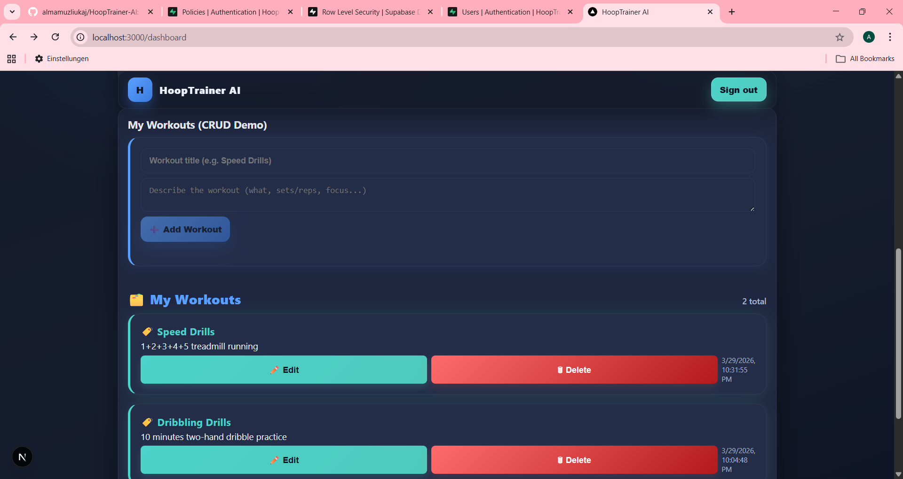

## Reflection

### What is RLS and why is it important?
Row Level Security (RLS) is a feature in Supabase and PostgreSQL that lets us define policies to control which rows each user can access or modify in a table. For my “workouts” app, RLS is essential because it makes sure that every user can only see and change their own workouts. Without RLS, any logged-in user could view or alter every workout in the database, creating a critical privacy and security risk.

### How did I connect the table to auth using `user_id`?
In my Supabase database, I created a table called `workouts` with columns: `id` (uuid, primary key), `user_id` (uuid, foreign key referencing `auth.users.id`), `title`, `description`, and `created_at`. When the user fills out the “Add Workout” form, my application always sets `user_id` to the current user's ID from Supabase Auth. This links each workout directly to the creator. The foreign key constraint ensures that each workout must belong to an authenticated user.

### What happens if you do not activate RLS?
If RLS is not enabled, any user who signs in could query or change any workout in the `workouts` table—not just their own. In a CRUD app like this, that would mean users could see, edit, or delete workouts belonging to others. With RLS enabled and these policies:
```sql
CREATE POLICY "Users can select only their workouts"
ON workouts
FOR SELECT
USING (user_id = auth.uid());

CREATE POLICY "Users can insert their workouts"
ON workouts
FOR INSERT
WITH CHECK (user_id = auth.uid());
```
the database enforces that only the owner can see or create their workouts, even if there’s a bug or exploit in the frontend.

### Screenshot or description of testing with two users

To test this, I logged in as two different users. Each user sees only their own workout entries:
- In the first screenshot, User 1's dashboard shows "Speed Drills" and "Dribbling Drills."
- In the second screenshot, User 2's dashboard is completely different, with "Footwork Drills" and "Shooting practice."

This proves RLS is active and correct—no data leaks between users.




Each user’s workouts and CRUD actions are private and isolated. This setup follows best practices for multi-user security and privacy.